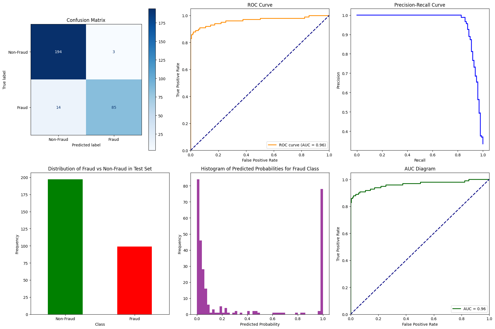
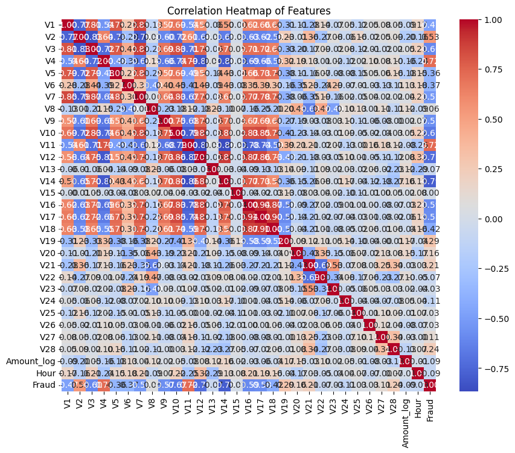

# Credit Card Fraud Detection Using Neural Networks

[](LICENSE)
[](https://www.python.org/)

## Overview

This project builds a robust neural network model to detect fraudulent credit card transactions. The dataset is highly imbalanced, with fraudulent transactions comprising less than 0.2% of the data. By addressing class imbalance, applying feature engineering, and optimizing the model, this project demonstrates how to effectively detect fraud in real-world scenarios.

## Key Features

- **Data Preprocessing:**
  - Log transformation of transaction amounts.
  - Hour extraction from transaction time.
  - Downsampling non-fraud cases to achieve a 2:1 ratio with fraud cases.
  - Feature scaling using `RobustScaler`.

- **Neural Network Architecture:**
  - Sequential model with multiple `Dense` and `Dropout` layers.
  - Class weighting to handle imbalanced data.
  - L2 regularization to prevent overfitting.

- **Cross-Validation:**
  - Tuning class weights during training to optimize the **F1 score** for fraud detection.
  - Early stopping and learning rate reduction to improve model performance.

- **Evaluation Metrics:**
  - **F1 score**, **Precision**, **Recall**, **ROC-AUC** score.
  - Confusion matrix and precision-recall curves for detailed evaluation.

## Dataset

The project uses the [Kaggle Credit Card Fraud Detection Dataset](https://www.kaggle.com/mlg-ulb/creditcardfraud). It contains 284,807 transactions with 31 features, including `Time`, `Amount`, and anonymized variables. The target variable `Class` indicates if a transaction is fraudulent (`1`) or not (`0`).

## Model Performance

The model achieves strong performance:

- **Best F1-score (Fraud) from Cross-Validation:** `0.93`
- **Best Precision (Fraud) from Cross-Validation:** `0.99`
- **Best Recall (Fraud) from Cross-Validation:** `0.87`

On the test set:

- **Final F1-score (Fraud):** `0.92`
- **Final Precision (Fraud):** `1.00`
- **Final Recall (Fraud):** `0.86`
- **Final ROC-AUC Score:** `0.96`

These results indicate that the model is highly effective at detecting fraudulent transactions, with high precision and recall.

## How to Run the Project

1. **Clone the repository:**

   ```bash
   git clone https://github.com/chunren/credit-card-fraud-detection-by-neural-network.git
   ```

2. **Install required packages:**

   Ensure you have Python 3.10 installed, and then run:

   ```bash
   pip install -r requirements.txt
   ```

3. **Download the dataset:**

   Download the dataset from [Kaggle](https://www.kaggle.com/mlg-ulb/creditcardfraud) and place it in the `data/` folder.

4. **Run the Notebook:**

   Open the notebook in JupyterLab or Jupyter Notebook, and run the code in the Section 4 of the notebook:

   ```bash
   jupyter notebook credit-card-fraud-detection-by-neural-network.ipynb
   ```

   This will preprocess the data, train the model, and output the evaluation metrics.

## Project Structure

```
.
├── data/                     # Folder for the dataset
├── models/                   # Saved models and checkpoints
├── plots/                    # Output plots for evaluation
├── credit-card-fraud-detection-by-neural-network.ipynb         # Main script to run the project
├── requirements.txt           # Python dependencies
└── README.md                  # Project description
```

## Visualization

The project includes various visualizations for model performance:

- **Confusion Matrix**
- **ROC Curve**
- **Precision-Recall Curve**
- **Correlation Heatmap** for feature relationships





## Future Work

Potential improvements for the project:

- **Hyperparameter Tuning:** Further optimize parameters like batch size and learning rate.
- **Advanced Class Balancing:** Experiment with techniques like SMOTE or ADASYN.
- **Ensemble Models:** Explore ensemble approaches like RandomForest or XGBoost to improve performance.


## License

This project is licensed under the MIT License. See the [LICENSE](LICENSE) file for details.

---

Feel free to fork this project, open issues, or contribute to its development!
